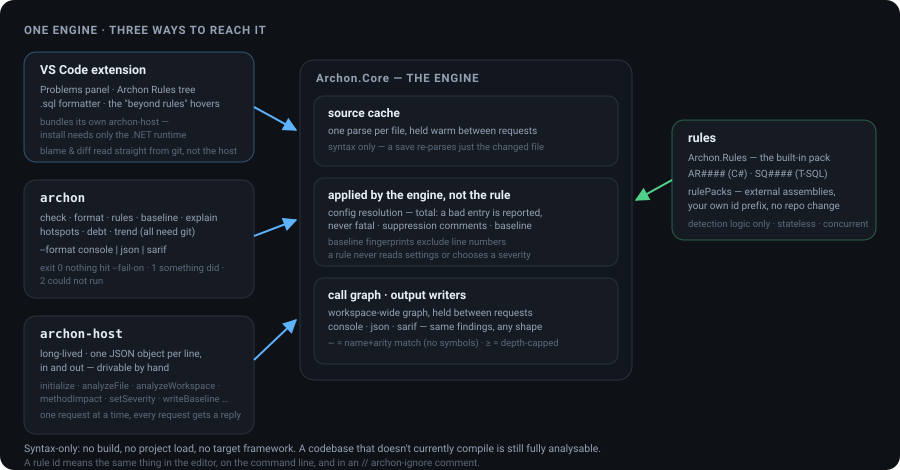
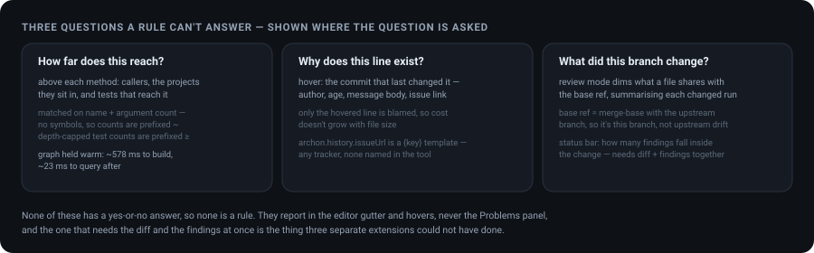

<div align="center">

# Archon

**Architecture, service-lifetime and T-SQL rules for C# and SQL — one engine, three ways in.**

Built-in rules for layering, DI lifetimes, async, performance, security and T-SQL, plus three
editor surfaces that answer questions a rule cannot. Reach the same engine from a VS Code
extension, a CLI built for CI, or a long-lived host process the other two drive.

Analysis is **syntax-only**: no project is loaded, no build is required, no target framework has
to be installed — so a codebase that does not currently compile is still fully analysable.

[](https://dotnet.microsoft.com)
[](#why-it-is-shaped-this-way)
[](#rules)
[](LICENSE)



</div>

---

## Why it is shaped this way

A rule is only worth writing if someone leaves it switched on. Three things decide that, and all
three are properties of the system rather than of any individual rule:

- **One process, one parse.** Every rule shares a single parse of each file, held warm between
  requests. Adding the fortieth rule costs almost nothing, so rules can be added freely.
- **One place to configure, suppress and accept.** A rule id means the same thing in the editor,
  on the command line and in a suppression comment. Rules contain detection logic only: they never
  read settings, never look for an ignore comment and never choose a severity.
- **A baseline.** Existing findings can be accepted in one step, after which only new ones fail a
  check. A rule can be adopted on a large codebase on the day it is written, instead of producing
  thousands of results and being turned off.

## Layout

| Path | What it is |
|---|---|
| `src/Archon.Core` | The engine: source cache, rule contracts, configuration, suppressions, baseline, output writers, call graph |
| `src/Archon.Rules` | The built-in rule pack |
| `src/Archon.Cli` | `archon` — the command line |
| `src/Archon.Host` | `archon-host` — the long-lived process the editor drives |
| `tests/Archon.Tests` | Behaviour assertions over the engine and every rule |
| `vscode/archon-vscode` | The editor extension, bundling its own copy of the host |
| `samples/AcmeRules` | A rule pack living outside the engine, and a workspace that loads it |

## Getting started

Requires the .NET 10 SDK. Node.js is needed only to build the extension.

```
dotnet build Archon.slnx
dotnet tests/Archon.Tests/bin/Debug/net10.0/archon-tests.dll
dotnet src/Archon.Cli/bin/Debug/net10.0/archon.dll check tests/fixtures/sample
```

The extension's own parsers are tested separately, without VS Code, by `npm test` in
`vscode/archon-vscode`.

`archon init` writes a starter `.archon.json` at the root of the repository you want to analyse,
along with the JSON Schema describing it. `.archon.example.json` shows a fuller one to copy from.
Without a configuration file everything runs at its default severity, except the layering rule,
which stays silent until layers are declared.

The house style is described by `.editorconfig` and enforced by the build, so `dotnet format
Archon.slnx` is the fix for any style failure. Only the mechanical rules — formatting and naming —
can fail a build; anything needing judgement is a suggestion an editor shows and no build reads.

Archon runs on itself. [`.archon.json`](.archon.json) at the root configures it, the accepted debt
is in `.archon-baseline.json`, and [the CI workflow](.github/workflows/ci.yml) fails on any new
warning, uploads a SARIF log, annotates pull requests with findings on changed lines, and fails once
any baselined finding has been accepted for over a year. `archon check .` should print no findings
on a clean checkout; if a change makes it print one, that is the review comment.

## The command line

```
archon check [path]        Analyse a folder or file and report findings.
archon format [path]       Format a folder or file of T-SQL in place.
archon rules [path]        List every rule and its effective severity.
archon baseline [path]     Accept current findings, so only new ones fail.
archon explain <ruleId>    Describe one rule.
archon init [path]         Write a starter .archon.json and its schema.
archon schema [path]       Print the JSON Schema for .archon.json.
archon hotspots [path]     Rank C# files by complexity x churn. Needs a git repository.
archon debt [path]         Rank baseline entries by age x churn since acceptance. Needs git.
archon trend [path]        Show baseline finding counts over the baseline file's own history.
archon --version           Print the version.
```

`check` takes `--format console|json|sarif|github`, `--fail-on error|warning|information|hint|never`,
`--no-baseline`, `--output <file>`, `--since <ref>` and `--fix`. `baseline` takes `--prune`, which
drops entries that no longer match instead of re-recording everything. `format` takes `--check`, which reports which files would
change without writing them and exits `3` if any would — the same contract the standalone
`sqlfmt-tsql` tool this was folded in from uses, so a CI step written against that tool needs no
change to run against `archon format --check` instead. `init` takes `--force`, and `schema` takes
`--output <file>`. `hotspots` takes `--days <n>` (default 180), `--top <n>` (default 20) and
`--format console|json`; it multiplies each C# file's cognitive complexity by how many commits
touched it in the window, so files that are both hard to follow and frequently edited surface
first. Either signal alone is a weak predictor of risk — complex code nobody touches is stable —
but the two together are the classic hotspot heuristic.

`debt` takes `--top <n>` (default 50, `0` for all), `--format console|json` and `--fail-over
<age>` (e.g. `180d`). Every baseline entry has a birthday — the commit that first added its
fingerprint to the baseline file, found the same way `git log -S` finds any string's history —
and this ranks entries by how old that birthday is, multiplied by how much the file has changed
since. A suppression sitting untouched on stable code is one thing; one sitting on code that has
moved six times since it was accepted is quietly rotting. `--fail-over` turns that into a gate: a
build fails once any accepted finding crosses the given age, so debt cannot go invisible forever.

`trend` takes `--limit <n>` (default 20, `0` for all) and `--format console|json`. The baseline
file already lives in git, so its own commit history is a time series of the codebase's accepted
debt with no extra storage: this walks the revisions that touched it and reports the total finding
count and per-rule breakdown at each one, so a rule's count climbing release over release is as
visible as its count today.

Exit codes are `0` when nothing reached the `--fail-on` level, `1` when something did, and `2`
when the command could not run. A pipeline step is usually:

```
archon check . --format sarif --output archon.sarif --fail-on error
```

The SARIF log includes baselined findings as well as new ones, each marked with its
`baselineState` (`new` or `unchanged`) and, for a baselined one, an external suppression naming the
baseline. A code-scanning consumer that tracks alerts across uploads then sees accepted debt as
accepted rather than as fixed one run and new the next; the `--fail-on` decision still counts only
the new ones. Each built-in rule links back to the table under [Rules](#rules).

### Checking only what a branch changed

```
archon check . --since origin/main --format github
```

A whole-repository report is the right thing to gate a build on, and the wrong thing to put in
front of someone reviewing a pull request, because most of it is about code they did not write.
`--since <ref>` keeps only the findings whose span touches a line added or changed since the merge
base with `<ref>` — what this branch did, not everything that landed on the base since it was cut.
Uncommitted edits and untracked files count as changed, so the same command answers "what did I
just introduce?" at a terminal. Analysis itself is not narrowed: a workspace-scope rule still sees
every file, and only its report is filtered, so the `--fail-on` decision is about the change alone
while the rules still had the whole picture to decide with.

`--format github` writes one workflow command per finding, which the Actions runner turns into an
annotation on the file and line — shown inline on the pull request's diff when the line is part of
the change. No upload step, no token. The two together are the review-time complement to the SARIF
gate above, and [the workflow this repository runs on itself](.github/workflows/ci.yml) uses both.

### Applying fixes

```
archon check . --fix
```

A rule that is certain of the rewrite carries it on the finding: `AR0020` (`Count() > 0` →
`Any()`), `AR0022` (dropping the `.ToList()` copy), `AR0090` (`ToUpper()` → `ToUpperInvariant()`),
`AR0014` (`throw ex;` → `throw;`), `AR0015` (`Thread.Sleep(n);` → `await Task.Delay(n);`, where
the call is a statement of the async method itself and not inside a lambda, local function or
`lock`) and `SQ0021` (`= NULL` → `IS NULL`). `--fix` applies every one,
then analyses again and reports what remains, so the report describes the files as they now are.
Two fixes wanting the same characters are not merged: the first in document order is applied and
the other waits for the next run. The same fix is what the editor offers as a quick fix and what the
JSON and SARIF reports carry, because it is decided once, in the rule, not re-derived per surface.

## The editor extension

```
cd vscode/archon-vscode
npm install
npm run publish-host
npm run compile
npx @vscode/vsce package
code --install-extension archon-analysis-0.5.0.vsix
```

The packaged `.vsix` carries its own published host, so installing it needs only the .NET runtime.

Findings appear in the Problems panel like any other linter. **Archon Rules** in the Explorer
lists every rule grouped by category with its severity and current finding count; each row can be
switched off, given a different severity, or described. Changes made there apply for the session,
and the log records the configuration entry that would make one permanent.

Saving a `.cs` or `.sql` file re-analyses that file with the rules a single file can decide.
Rules needing the whole workspace run on **Archon: Analyse Whole Workspace**. Set
`archon.analyseOn` to `type` to analyse while typing, or `manual` for nothing automatic.

Archon also registers as a formatter for `.sql`: **Format Document** (`Shift+Alt+F`) and
`editor.formatOnSave` both work once Archon is picked as the default formatter for T-SQL, using
the same loss-safe formatter `archon format` runs on the command line. **Archon: Format SQL File** and
**Archon: Format SQL Folder** format `.sql` files directly from the Explorer's right-click menu,
without opening them first.

## Beyond rules



Three questions come up constantly while changing code, and none of them has a yes-or-no answer, so
none of them belongs to a rule. They are reported where the question is asked instead of in the
Problems panel.

**How far does this reach?** Above each C# method, how many callers it has, how many projects those
sit in, and how many tests reach it. Selecting the line lists the call sites and navigates to one.

Calls are matched on name and argument count, because there is no compilation to resolve symbols
against. Overloads sharing a name and argument count are counted together, and calls through
reflection, dynamic dispatch or a container are invisible. Counts are therefore prefixed `~`, and a
test count cut off by the search depth is prefixed `≥`, so a lower bound is never read as a total.

The graph spans the workspace and is held between requests. A first query pays for parsing; later
ones do not, and a save re-parses only the file that changed. Against this repository, 578 ms to
build and 23 ms to query afterwards.

**Why does this line exist?** Hovering shows the commit that last changed it, with its author, age
and message body, and links the first issue key found. Only the hovered line is blamed, so cost does
not grow with file size. `archon.history.issueUrl` is a template containing `{key}`, so any tracker
can be addressed without naming one. Hovering a method already carrying an impact line folds its
reach into the same tooltip, so how far a method reaches and who last changed it read as one answer
rather than two.

**What did this branch change?** Review mode dims everything a file has in common with the base ref
and summarises each changed run above itself, with `Alt+Up` and `Alt+Down` to move between them. The
base ref defaults to the merge base with the upstream branch, so the comparison shows what this
branch did rather than everything that happened upstream since.

Review mode is a property of the session rather than of one file, so it covers files opened after it
is entered. While it is on, the status bar also reports how many of the active file's findings fall
inside the change — which needs the diff and the findings together, and is the one thing none of
these surfaces could report while they were separate extensions.

A file with no changes is left undimmed rather than dimmed wholesale, because an evenly faded file
with no explanation reads as a fault rather than as "nothing changed here".

## Configuration

`.archon.json`, found by walking up from the analysed path.

```json
{
  "rules": { "AR0001": "error", "AR0005": "off", "sql": "warning" },
  "exclude": ["**/Generated/**"],
  "layers": {
    "mode": "denylist",
    "layers": { "Domain": ["MyApp.Domain"], "Infrastructure": ["MyApp.Infrastructure"] },
    "deny": [{ "id": "domain-stays-pure", "from": "Domain", "to": "Infrastructure" }]
  },
  "rulePacks": [],
  "overrides": [
    { "files": ["tests/**"], "rules": { "AR0073": "off", "AR0061": "off" } }
  ],
  "baseline": ".archon-baseline.json"
}
```

A key in `rules` is either a rule id or a category name, so a whole family can be set at once; an
explicit id always wins over its category. Severities are `error`, `warning`, `information`,
`hint` and `off`.

### Settings for part of a tree

A test project legitimately writes to the console and repeats string literals; a generated folder
should not be held to a complexity threshold; a payments module might want `AR0054` at `error`
where the rest of the codebase has it at `warning`. `overrides` is a list of blocks, each naming
the files it applies to and carrying its own `rules` and `options`, layered over the top-level ones
for matching files only. Without it the choices were to switch a rule off everywhere or to exclude
the files from every rule, and both throw away findings that were wanted.

Resolution for a finding is: a session override made in the editor; then each matching block from
last to first, its rule-id entry before its category entry; then the top-level `rules` the same
way; then the rule's default. A block's category entry therefore beats a top-level rule id — the
block is the more specific statement, having named the files. A rule off at the top level but on
in one block still runs, for that block's files. A block's `options` entry replaces the top-level
one whole for the rule named, rather than merging into it, so what a rule reads is always
something someone wrote.

A file-scope rule is told which of its ids are on for the file in hand, so a block that switches
a costly check off for a folder saves the work as well as the report. This repository's own
[`.archon.json`](.archon.json) is the worked example: the command-line project and the tests may
write to the console, and the tests are not held to the complexity or duplication rules.

### When configuration says something Archon cannot act on

Resolution is deliberately total: an entry it cannot read is treated as absent, because a file
that stopped analysis on a typo would be worse than one that ignored it. The cost is that the
failure is invisible — `"AR010": "off"` reads as switching a rule off and in fact does nothing,
and `"AR0010": "eror"` leaves the rule at its default rather than raising it.

Every surface therefore reports what resolution had to ignore, on standard error for the command
line and in `messages` for the host:

```
archon: Configuration: 'AR010' in "rules" is not a known rule id or category — did you mean
        'AR0010'? The entry has no effect.
archon: Configuration: layer edge 'domain-stays-pure' in "deny" names 'domain' as its "from"
        layer, which is not declared, so the edge never matches. Layer names are case-sensitive;
        the declared layer is 'Domain'.
```

These are warnings about the configuration and never stop a run. Layer names are compared exactly,
unlike rule ids, which is why case is called out. A `mode` that is neither `denylist` nor
`allowlist` falls back to `denylist` — the permissive reading — so a misspelling of `allowlist`
quietly turns "permit only what is listed" into "forbid only what is listed", and is reported.

### Editor completion for the configuration file

`archon init` also writes `.archon.schema.json` and points `$schema` at it, so an editor offers
every rule id as a completion, shows its title and default severity on hover, and marks an unknown
key or an invalid severity as you type — a shorter loop than any message the tool can print after
a run.

The schema is generated from the rules actually registered, including those from private packs, so
it describes your installation rather than a fixed list. Regenerate it with `archon schema` after
adding or upgrading a pack. A rule id the schema does not know stays permitted, so a configuration
naming a pack that is not loadable on this machine is not marked as an error.

## Suppressing a finding

One syntax, honoured by every rule because the engine applies it rather than the rule:

```csharp
services.AddSingleton<ICache, Cache>();  // archon-ignore[AR0002] single-threaded startup only
```

The marker applies to its own line and the line below it, so it can sit above the code it
concerns. Listing several ids suppresses each; naming none suppresses every rule on that line.
`// archon-ignore-file[AR0002]` covers a whole file.

## Baselines

```
archon baseline .
```

Records every current finding in `.archon-baseline.json`. Those findings are still reported and
counted separately, but no longer fail a check — only new ones do. Entries are matched on a
fingerprint that excludes line numbers, so editing elsewhere in a file does not resurrect an
accepted finding as a new one.

An entry outlives its finding once the code is fixed, and `check` counts those: `3 baseline
entrie(s) no longer match anything`. `archon baseline --prune` drops them and accepts nothing new,
so it is safe to run on any branch; a plain `archon baseline` rewrites the file from scratch and
would accept whatever that branch introduced. An entry is only judged stale when the run could have
reproduced it — its rule ran, over its file — so a check of one folder leaves entries for the rest
of the tree alone, as does a rule that is switched off or that failed. An entry naming a file that
no longer exists is stale whatever ran.

## Rules

| Id | Severity | Scope | Category | What it flags |
|---|---|---|---|---|
| `AR0001` | warning | file | architecture | A layer references another layer the rules forbid |
| `AR0002` | error | workspace | lifetime | A singleton holds a scoped service |
| `AR0003` | warning | workspace | lifetime | A singleton holds a transient service |
| `AR0004` | information | workspace | lifetime | A scoped service holds a transient service |
| `AR0005` | off | workspace | lifetime | A dependency has no visible registration |
| `AR0010` | warning | file | async | A task is blocked on rather than awaited |
| `AR0011` | warning | file | async | A task-returning call is discarded |
| `AR0012` | warning | file | async | An `async void` method that is not an event handler |
| `AR0013` | warning | file | async | An empty catch block |
| `AR0014` | warning | file | async | `throw ex;` inside a catch block resets the stack trace |
| `AR0015` | warning | file | async | `Thread.Sleep` blocks a thread inside an async method |
| `AR0020` | information | file | performance | A sequence is counted to test whether it is empty |
| `AR0021` | information | file | performance | String concatenation inside a loop |
| `AR0022` | hint | file | performance | A sequence is copied then transformed again |
| `AR0023` | information | file | performance | Inline SQL selects all columns |
| `AR0030` | warning | project | configuration | A configuration key is in no settings file |
| `AR0031` | information | project | configuration | A settings file could not be read |
| `AR0040` | error | workspace | architecture | A project reference cycle |
| `AR0041` | information | workspace | architecture | A project file could not be read |
| `SQ0001` | warning | file | sql | A statement selects all columns |
| `SQ0002` | information | file | sql | A file could not be parsed as T-SQL |
| `SQ0010` | warning | file | sql | A table reference breaks the hint policy |
| `SQ0011` | warning | file | sql | A temporary table breaks the naming pattern |
| `SQ0012` | warning | file | sql | A stored procedure breaks the naming pattern |
| `AR0050` | warning | file | security | A string literal is assigned to a name that reads as a credential |
| `AR0051` | warning | file | security | A cryptographic primitive known to be weak by its written name is used |
| `AR0052` | information | file | security | System.Random is used for a value whose name reads as security-sensitive |
| `AR0053` | warning | file | security | A regex pattern contains a group that is itself quantified, risking catastrophic backtracking |
| `AR0054` | warning | file | security | SQL is built by string concatenation or interpolation instead of a parameterised query |
| `AR0060` | warning | file | complexity | A method's cognitive complexity crosses the configured threshold (default 15) |
| `AR0061` | information | file | complexity | The same string literal appears several times in one file |
| `AR0070` | hint | file | maintainability | A method parameter is never read in the method body |
| `AR0071` | information | file | maintainability | A local variable is declared and never read again |
| `AR0072` | information | file | maintainability | An 'if' or ternary condition is a literal true/false, or compares an identifier to itself |
| `AR0073` | hint | file | maintainability | Console.Write/WriteLine is called directly instead of through a logger |
| `AR0074` | warning | file | maintainability | A well-known disposable local is never disposed on any path the rule can see |
| `AR0075` | information | file | maintainability | A public, non-readonly field on a class exposes mutable state directly |
| `AR0080` | warning | workspace | sql | A column named in inline SQL does not exist on the table it targets (single-table statements only) |
| `AR0090` | information | file | globalization | `ToUpper()`/`ToLower()` casts case using the current culture instead of an invariant one |
| `SQ0020` | warning | file | sql | A DELETE or UPDATE statement has no WHERE clause |
| `SQ0021` | warning | file | sql | A comparison to NULL uses `=`/`<>` instead of `IS [NOT] NULL` |

`Scope` is what a rule needs in order to decide, and therefore when it runs. A `file` rule runs on
every save; a `project` rule also runs on save, over the project that owns the saved file; a
`workspace` rule runs on a full pass.

`SQ0010`, `SQ0011` and `SQ0012` enforce team convention rather than universal truth, so each stays
silent until configured:

```json
{
  "options": {
    "SQ0010": { "policy": "required" },
    "SQ0011": { "pattern": "^#tmp[A-Z]" },
    "SQ0012": { "pattern": "^usp_" }
  }
}
```

`policy` is `required`, `forbidden` or `none`. A pattern that does not compile is ignored rather
than failing the pass. `AR0030` accepts `{ "additionalSettingsFiles": ["config/shared.json"] }` for
settings that do not sit beside the project.

### What syntax-only analysis cannot do

Type and namespace resolution is by text as written, not by resolved symbol. Two distinct types
sharing a simple name across namespaces can be conflated, alias `using` directives are skipped,
global usings declared elsewhere are invisible, and registrations built dynamically are not seen.

Rules are written to be silent rather than speculative where this matters:

- The lifetime rules only report when both lifetimes are visible in a literal registration.
- A file whose namespace matches no declared layer is never flagged.
- `AR0021` only reports an identifier explicitly declared `string`, never one declared `var`.
- `AR0020` distinguishes the invocation `Count()` from the property `Count` by node shape, so a
  collection that already knows its size is not reported.
- `AR0023` decides by parsing the literal as T-SQL, so prose containing the same words is silent.
- `AR0010` and `AR0011` decide that an expression is task-typed from three syntactic signals: a
  call named for an asynchronous operation, an identifier named after a task, or being inside an
  `async` method. A member called `Result` on something matching none of these is left alone, and a
  task-returning method not named for an asynchronous operation is not seen.
- `AR0030` words every finding as a possibility, because a key can legitimately come from an
  environment variable or a secret store.
- `AR0070` cannot see an interface's members without symbols, so a public instance method on a
  type whose base list names an interface (by the `IName` convention) is left alone, as an
  `override` or explicit implementation already is: the parameter may not be the method's to drop.
- `AR0075` only checks `class` declarations; a `struct`'s public fields are left alone, since a value
  type commonly exposes them by design, and so is a class nested privately in another, whose fields
  only the enclosing type can reach.
- `AR0090` only recognises a receiver declared (or literally) `string`, the same limitation `AR0021`
  carries; a property chain or a `var`-declared receiver is not seen.
- `SQ0020` exempts a `DELETE` whose target table is named `#...`, since clearing a whole staging
  table before reloading it is a common, deliberate pattern.

## Adding a rule

Implement `IRule`, declare one `RuleDescriptor` per separately reportable condition, and add it to
`BuiltInRulePack`. The engine handles parsing, parallelism, severity, suppression, baselines and
every output format.

A rule that detects several materially different problems should declare a descriptor for each, so
they can be configured and switched off independently rather than sharing one severity.

Rules must be stateless and safe to call concurrently, and must only report ids they declared.

A rule that is certain of the rewrite sets `Fix` on the finding — a title and a list of `TextEdit`
regions — and every surface applies it without further thought: the editor as a quick fix, the
command line under `--fix`, the JSON and SARIF reports as data. The engine is syntax-only, so offer
one only where what the rule matched already guarantees the edit is safe, and withhold it
otherwise: a finding without a fix is a finding, a finding with a wrong fix is a bug report.
`ParsedCSharp.SpanOf` turns a Roslyn span into the line-and-column region the edit needs.

### Rules outside this repository

`rulePacks` names assemblies to load, each exposing one or more `IRulePack` implementations. A
private or organisation-specific rule set therefore lives outside this repository and needs no
change to it. A pack that fails to load is reported and skipped rather than stopping analysis.

A worked example lives in `samples/`, and it builds and runs with everything else:

```
dotnet build Archon.slnx
dotnet src/Archon.Cli/bin/Debug/net10.0/archon.dll check samples/example
```

```
Orders.cs
      5:1    warning     ACME0002  'System.Data.SqlClient' is under the forbidden namespace 'System.Data.SqlClient'.
     15:22   error       ACME0001  HttpClient is constructed directly. Inject IHttpClientFactory instead.
```

`samples/AcmeRules` is the pack: a project referencing `Archon.Core`, one rule decidable from a
single file, one rule that reads its own options and reports two conditions, and the `IRulePack`
that lists them. `samples/example` is a workspace whose `.archon.json` loads the built assembly.

Three things in that project file and configuration are worth copying:

- **`Private="false"` on the project reference.** The process loading a pack has already loaded
  `Archon.Core`. A second copy beside the pack risks the runtime binding to that one instead,
  leaving two `IRulePack` types that are not the same type — the pack then loads without error and
  contributes nothing.
- **A parameterless constructor on the pack.** It is found by reflection and constructed directly.
  There is no attribute to apply and no manifest to keep in step.
- **A prefix of your own on rule ids.** An id already registered is refused with a diagnostic and
  the rule is dropped, so `ACME0001` is safe where `AR0001` would collide.

Once loaded, an external rule is indistinguishable from a built-in one. In the example above
`ACME0001` takes `error` from its own key while `ACME0002` takes `warning` from the `architecture`
category, and `// archon-ignore[ACME0001]` suppresses a finding the rule itself knows nothing
about — configuration, suppression and the baseline are applied by the engine, which is why a rule
never reads settings, never looks for an ignore comment and never chooses a severity.

Two things to expect while writing one:

- **Scope is a latency decision.** `File` re-runs on every save, `Workspace` only on request. A
  rule declaring more scope than it needs is the main source of avoidable delay.
- **A rebuilt pack needs a window reload, not a configuration reload.** An assembly already loaded
  is never loaded again, so **Archon: Reload Configuration And Rules** will keep using the previous
  build. Reload the window, or give each build a new assembly version.

## The host protocol

`archon-host` reads one JSON object per line on standard input and writes one per line on standard
output, which makes it drivable by hand while diagnosing it:

```
{"id":1,"method":"initialize","params":{"root":"C:\\src\\app"}}
{"id":2,"method":"analyzeFile","params":{"path":"C:\\src\\app\\Program.cs"}}
{"id":3,"method":"shutdown"}
```

Methods are `initialize`, `listRules`, `analyzeFile` (optionally with in-memory `text`),
`analyzeWorkspace`, `formatFile`, `methodImpact`, `methodTrace`, `setSeverity`, `invalidate`,
`reloadConfig`, `writeBaseline` and `shutdown`. Replies are `{"id":n,"ok":true,"result":{...}}` or
`{"id":n,"ok":false,"error":"..."}`. A finding whose rule offers a rewrite carries it as `fix`:
`{"title":"...","edits":[{"startLine","startColumn","endLine","endColumn","newText"}]}`, zero-based,
the same shape the JSON report uses.

Git is not part of this protocol. Blame and diff are read by the extension directly, because they
need no parse, no configuration and no warm state — putting them here would only add a hop.

Requests are handled one at a time in arrival order and every request gets a reply. A client that
does not want to queue work it no longer needs waits for the previous reply before sending the
next request.

## Explanations

`IFindingExplainer` is an optional seam for prose about a finding that has already been detected.
The default implementation explains nothing and requires no configuration. Detection never
consults it, so results stay reproducible and identical offline; an explainer only ever adds
commentary to a finding produced without it.

---

<div align="center">
<sub>An archon was the magistrate who saw that the rules were kept. This one only reads.</sub>
</div>
